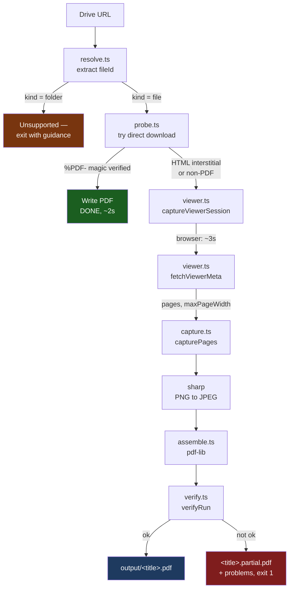
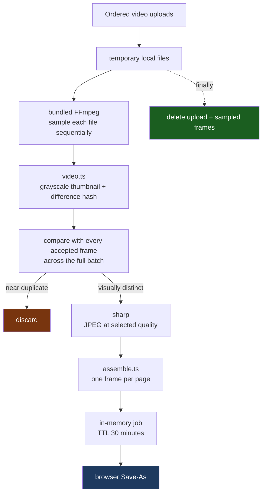
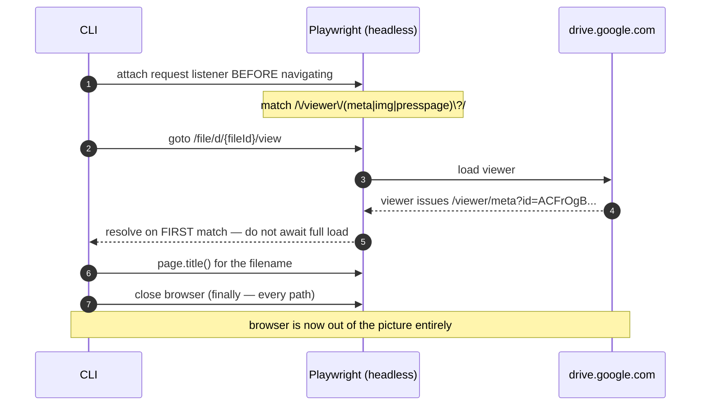
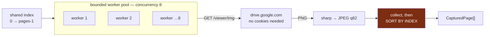
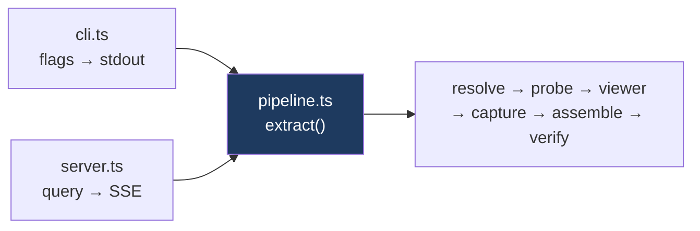
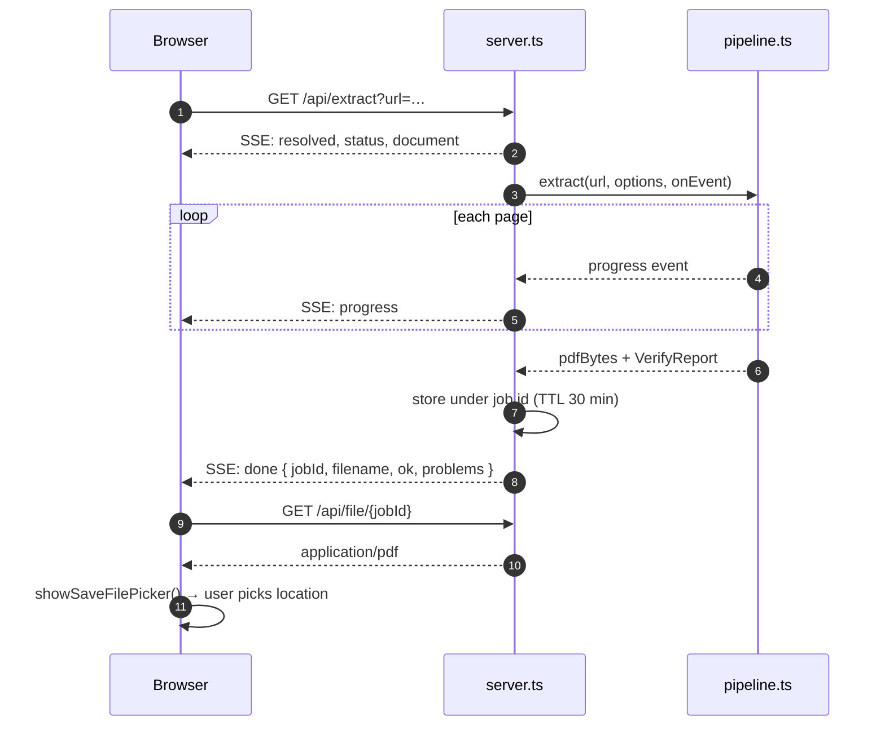

# PDF Capture Studio — Architecture

Provides two local PDF pipelines: reconstructing a Google Drive file shared with
**view-only** permission, and converting the unique visual frames in a video to PDF pages.

- **Stack:** TypeScript + Playwright + FFmpeg + `pdf-lib` + `sharp` (standalone Node project)
- **Reference document:** [159-page sample](https://drive.google.com/file/d/18zM6cKYhTF2MRd0Ml8Vo3rGZTpckOfxd/view)
- **Location:** `src/`

> **Precondition:** only extract documents you are permitted to retain a copy of.
> View-only is sometimes a deliberate retention control, not just a convenience setting.

---

## 1. The finding that shaped this design

The first draft of this document assumed the only way in was to drive the viewer UI:
scroll page by page, wait for lazy rendering, screenshot each page element, and fight
Drive's virtualisation (it unloads pages once scrolled past).

Probing the live viewer showed that is unnecessary. Drive's viewer fetches each page
from a **directly addressable, parameterised endpoint**:

```
GET /viewer/img?id={viewerId}&page={i}&w={px}
```

Given the `viewerId`, any page can be requested at any time, in any order, at a chosen
resolution. That removes the scroll loop, the lazy-render waits, the virtualisation
race, and the screenshot fidelity loss — **the four hardest parts of the original
design, all deleted rather than solved.**

The browser is now needed for one thing only: obtaining the token.

---

## 2. Verified endpoint behaviour

Measured against the live 159-page sample. Nothing here is inferred.

| Fact | Value |
|---|---|
| Token shape | opaque `ACFrOgB…`, ~300 chars — **not** the file ID |
| Token source | `id` query param on any `/viewer/{meta,img,presspage}` request |
| Token auth | **works with cookies omitted** → page fetching needs no browser |
| Metadata | `/viewer/meta?id=…` → `)]}'\n{"pages":159,"maxPageWidth":3200}` |
| XSSI prefix | present — must strip to first newline before `JSON.parse` |
| Page indexing | **0-based**; `page=159` on a 159-page doc → HTTP 400 |
| Width cap | `w > maxPageWidth` → HTTP 400 |
| Default format | **PNG**; `&webp=true` → WebP |
| JPEG | **not available** — `format=jpeg`, `jpeg=true`, `mimetype=image/jpeg` all still return PNG |
| Caching | `Cache-Control: no-store` |

### Measured page sizes (16:9 slide, page 100)

| `w` | Dimensions | PNG size | × 159 pages |
|---|---|---|---|
| 800 | 800×450 | 219 KB | ~34 MB |
| 1600 | 1600×900 | 927 KB | **~148 MB** |
| 3200 | 3200×1800 | 2453 KB | **~390 MB** |

**Consequence:** the endpoint will not serve JPEG, and raw PNG for a long deck is
unusable as an output size. A PNG → JPEG re-encode is therefore a **required** stage,
not an optional one. At `w=1600, q=82` a page lands around 120 KB → ~20 MB total.

---

## 3. Pipeline

### 3.1 Drive document pipeline



### 3.2 Video unique-frame pipeline



The detector cannot use exact file hashes because video compression makes adjacent renders of
an unchanged slide byte-different. Each sampled frame is reduced to a 17×16 grayscale thumbnail
and a 256-bit horizontal difference hash. A candidate is discarded only when both its structural
hash distance and mean pixel difference are within sensitivity-derived tolerances. Matching is
global rather than adjacent-only or file-local, which removes a slide even when it is revisited
in a later video. First-seen frame order follows the user's selected file order.

Uploads are streamed directly to an OS temporary directory rather than buffered in memory. The
server deletes the upload and FFmpeg frame directory in `finally` blocks, including failed runs.
The completed PDF alone enters the existing in-memory job store.

---

## 4. Token capture — the only browser-bound step



The listener must be attached **before** navigation — the token-bearing request fires
early and is easily missed. Resolution happens on the first match rather than on load
completion, which is what keeps this step at roughly three seconds.

---

## 5. Page fetching



Two failure modes this shape exists to prevent:

- **Unbounded fan-out.** Building 159 promises and `Promise.all`-ing them ignores the
  concurrency limit entirely. A worker pool over a shared counter actually bounds it.
- **Completion-order corruption.** Concurrent fetches finish out of order. Results must
  be sorted by page index before assembly, or the PDF is silently scrambled — a defect
  that looks fine until someone reads page 40.

Retries use exponential backoff with jitter. An **expired token returns HTML, not an
image**, so a non-image content-type is treated as retryable and triggers a re-mint
rather than being embedded as garbage.

---

## 6. Modules

| Module | Responsibility | The failure it owns |
|---|---|---|
| `types.ts` | Shared contract; encodes the endpoint facts as documentation | Drift between stages |
| `resolve.ts` | Parse `fileId` from all Drive URL shapes; classify file vs folder | Unrecognised URL shape |
| `probe.ts` | Fast path; verify `%PDF-` magic, never throw | HTML interstitial mistaken for a PDF |
| `viewer.ts` | Capture token + title; fetch and validate meta | Missed token; unstripped XSSI prefix |
| `capture.ts` | Bounded pool, retry/backoff, re-encode, **sort by index** | Scrambled or dropped pages |
| `assemble.ts` | `pdf-lib`, per-page box sizing, `embedJpg`/`embedPng` dispatch | Mixed-orientation squashing |
| `verify.ts` | Count, completeness, blank and duplicate detection | **Shipping a truncated PDF** |
| `pipeline.ts` | The flow itself, progress emitted as events | Front ends drifting apart |
| `cli.ts` | Flags, progress, exit codes, non-clobbering output naming | Reporting success on a bad capture |
| `server.ts` | Local HTTP, SSE progress, in-memory job store | Leaking documents into memory |
| `ui.html` | Browser UI, native Save-As handling | — |
| `video.ts` | FFmpeg sampling, perceptual deduplication, PDF hand-off | Duplicate or missing video slides |
| `video.test.ts` | Synthetic repeated-scene integration test | Regressed global deduplication |

`verify.ts` is deliberately pure and synchronous. It is the last line of defence against
the tool's worst outcome — handing over a PDF that looks complete and is not.

### 6.1 Two front ends, one pipeline

`pipeline.ts` owns the sequence of stages and reports progress through a callback instead
of printing. The CLI turns those events into terminal output; the server turns the *same*
events into SSE frames. Neither can grow its own subtly different ordering of the stages,
and a bug fixed in the pipeline is fixed in both.



### 6.2 Why the UI exists at all

Only to get a **file picker**. Node cannot open a native Save-As dialog without Electron
or a native module; browsers already have one via the File System Access API
(`showSaveFilePicker`), and `http://127.0.0.1` counts as a secure context, so it is
available. Chrome and Edge support it; Firefox falls back to an ordinary download.

That decision has a consequence worth stating: **the server never writes a PDF to disk.**
It holds the bytes in memory under a job id and hands them to the page, which owns the
save. Jobs expire after 30 minutes so a long-lived server cannot accumulate hundreds of
megabytes of forgotten documents.



The server binds to `127.0.0.1` only. It drives a headless browser and fetches arbitrary
URLs on request, so it has no business being reachable from the network.

---

## 7. Layout

```
src/
  types.ts      # shared contract (hand-written, stable)
  resolve.ts    probe.ts      viewer.ts
  capture.ts    assemble.ts   verify.ts
  pipeline.ts   # the flow, shared by both front ends
  cli.ts        # front end 1: terminal
  server.ts     ui.html       # front end 2: browser
work/<fileId>/  # page images, only with --keep-pages   [gitignored]
output/         # finished PDFs from CLI runs           [gitignored]
```

A standalone project: `src/` holds everything, `output/` the finished PDFs from CLI runs,
and `work/` the per-page images when `--keep-pages` is set. The latter two are gitignored.
UI runs write nothing server-side — the browser saves the file.

---

## 8. Usage

```bash
npm run ui          # browser UI on http://127.0.0.1:5174, with a Save-As dialog
```

```bash
npx tsx src/cli.ts "https://drive.google.com/file/d/<ID>/view"
```

| Flag | Default | Effect |
|---|---|---|
| `--width=<px>` | `1600` | Render width; clamped to `maxPageWidth` |
| `--quality=<1-100>` | `82` | JPEG quality |
| `--png` | off | Embed lossless PNG — **very** large output |
| `--concurrency=<n>` | `8` | Parallel page fetches |
| `--out=<dir>` | `output` | Destination directory |
| `--keep-pages` | off | Retain individual page images |

---

## 9. Failure modes

| Failure | Detection | Handling |
|---|---|---|
| Blocked download misread as success | `%PDF-` magic byte check | Fall through to render path |
| Token never appears | 45 s race timeout | Explicit error naming the cause |
| Token expires mid-run | non-image content-type | Retryable → re-mint |
| Page fetch fails permanently | retry budget exhausted | Abort — never silently drop a page |
| Concurrent completion reordering | — | Sort by index before assembly |
| Rate limiting | HTTP 429 | Backoff with jitter |
| File needs a signed-in session | redirect to `accounts.google.com` | Clear error, no hang |
| `sharp` unavailable | dynamic import fails | Warn, fall back to PNG (valid, large) |
| Truncated capture | `verifyRun` | `.partial.pdf` + problems + **exit 1** |
| UI port already bound | `EADDRINUSE` | Named error suggesting `--port=` |
| Job requested after expiry | job absent from store | 404 with "extract it again" |
| Browser tab closed mid-run | `req.on('close')` | Stop writing SSE; run completes and is discarded |

---

## 10. Measured performance

Figures from actual runs against the 159-page reference document, not estimates.

| Metric | Value |
|---|---|
| Fast path (download permitted) | ~2 s |
| Token capture | ~3 s |
| 159 pages @ `w=1600`, concurrency 8 | **~1 min** |
| Output, `w=1600` q82 | **12.93 MB** (13,560,010 bytes) |
| Output, `--png` | ~148 MB |

Roughly a 3× wall-clock improvement over the scroll-and-screenshot design, at higher
fidelity, because pages come from the render endpoint rather than from screenshots.

Two independent runs produced **byte-identical page content** across all 159 pages; only
the PDF creation timestamp differs, so output is reproducible.

---

## 11. Known limitations

- **Folder links are not supported.** Pass individual file links; the CLI exits with
  guidance rather than half-working.
- **Output is raster.** Text is not selectable. An OCR stage (`--ocr`) is deferred; the
  page images are high enough resolution to OCR well later if it is wanted.
- **Viewer watermarks are captured** along with the page, since they are part of the
  render.
- **Tokens are short-lived**, so a run cannot be paused and resumed hours later.
- **Extraction cannot be cancelled.** The pipeline has no cancellation hook, so closing
  the browser tab stops the progress stream but not the work. Adding one means threading
  an `AbortSignal` through `capturePages`.
- **The Save-As dialog needs Chrome or Edge.** Firefox has no File System Access API and
  falls back to an ordinary download into its download folder.
- **UI runs hold the whole PDF in memory** until saved or expired. Fine for the sizes this
  tool produces; it is not a design for gigabyte documents.
